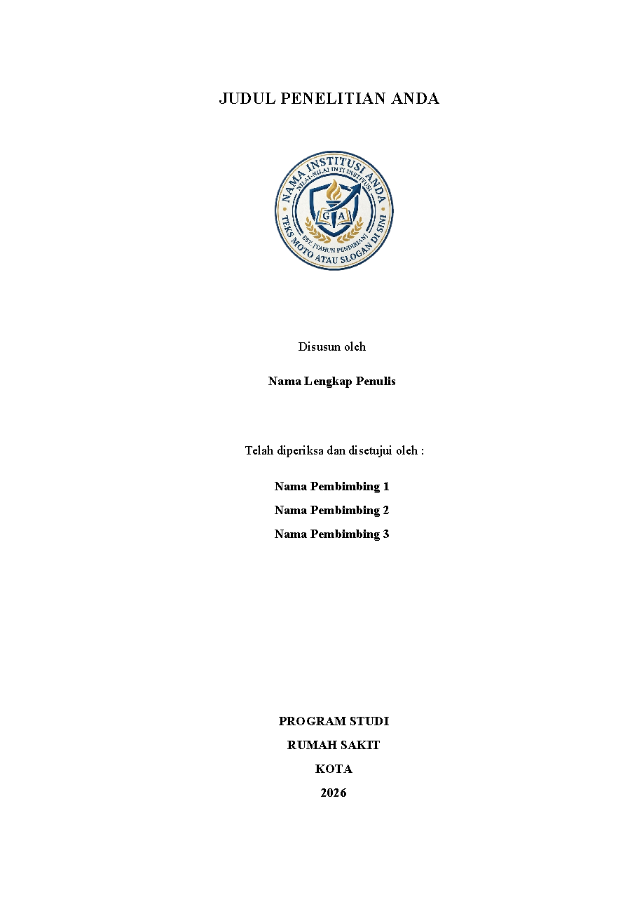
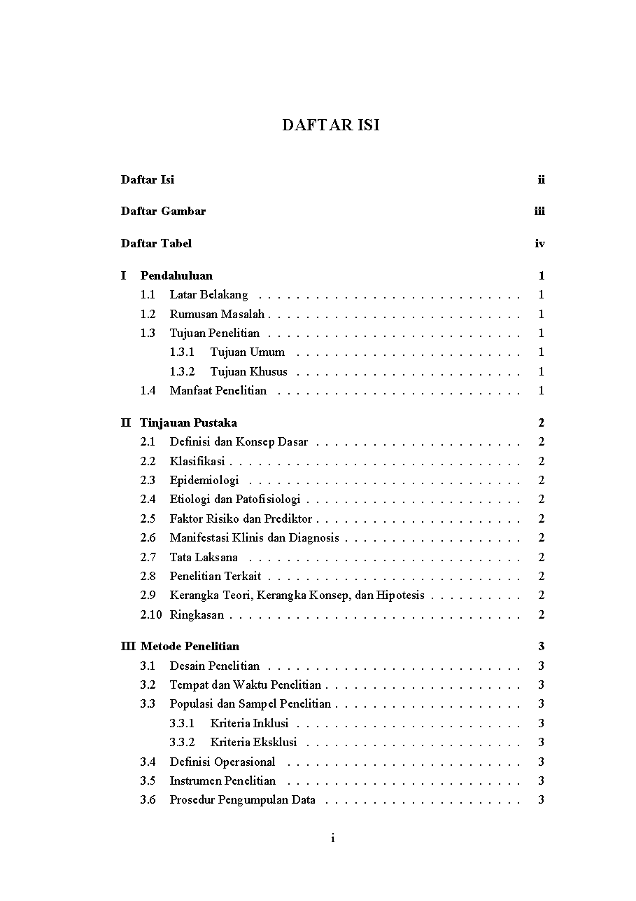
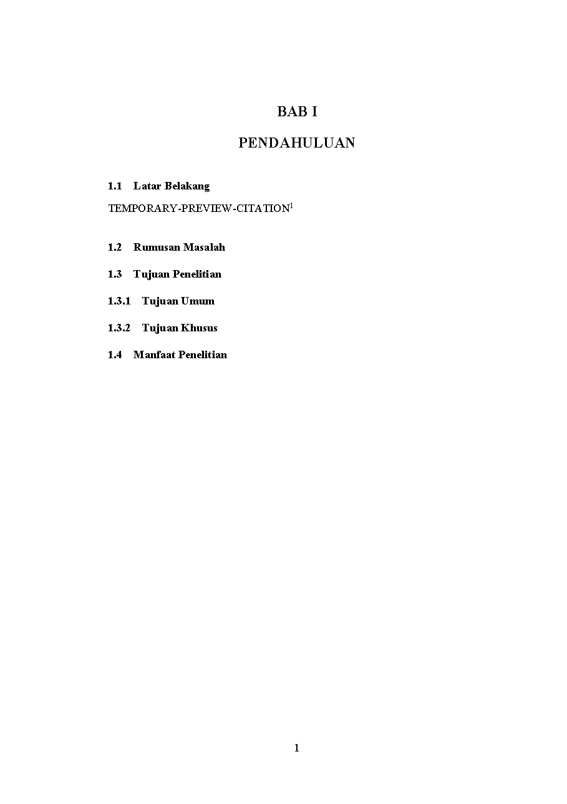
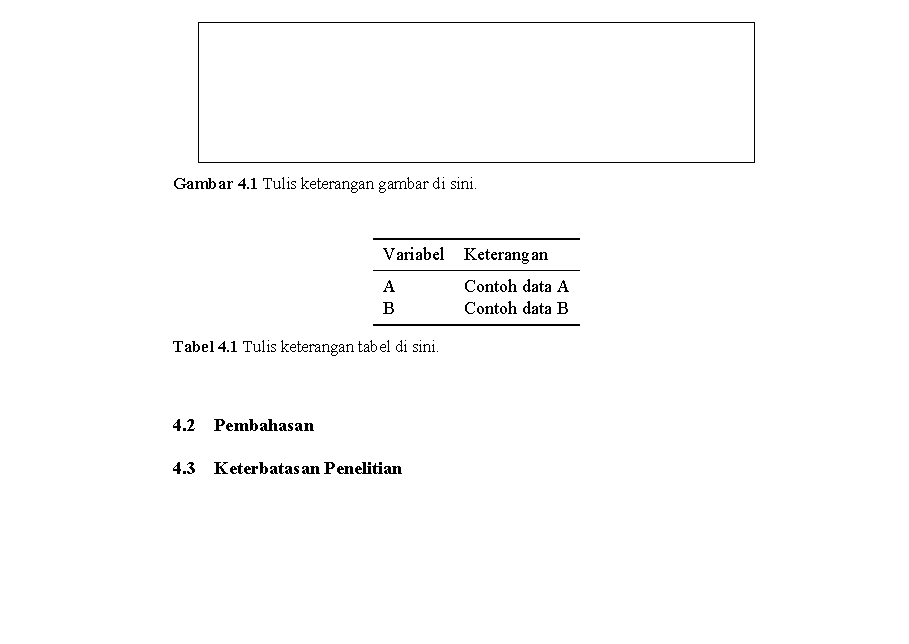
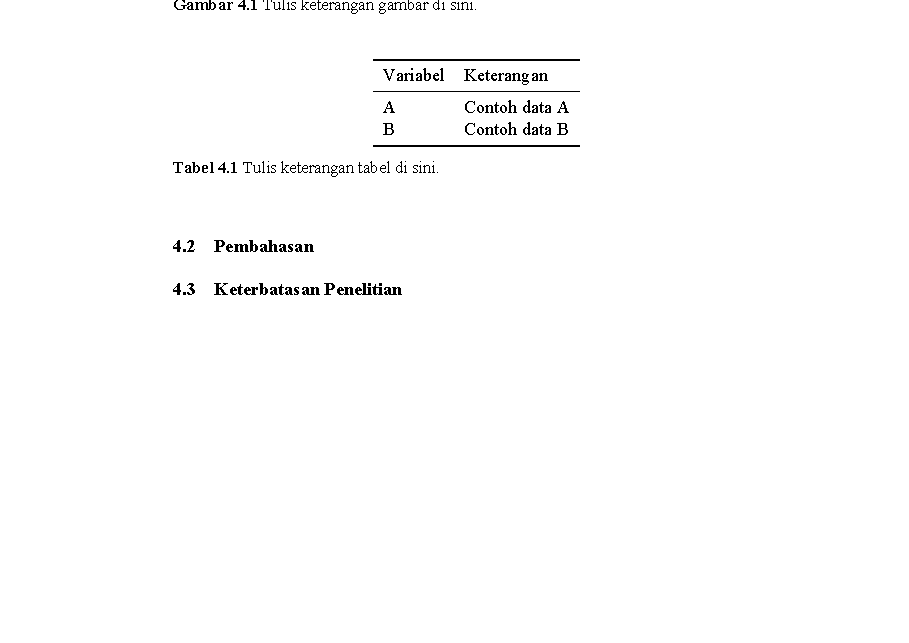
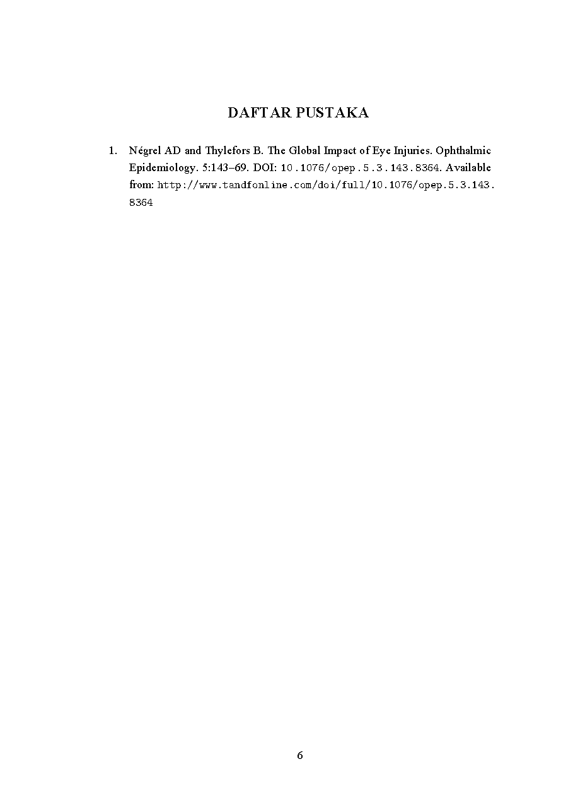

# Indonesian Academic LaTeX Framework

Kerangka (framework) penulisan ilmiah berbahasa Indonesia berbasis **LuaLaTeX** yang modular, terpelihara, dan siap dipakai ulang. Proyek ini **bukan sekadar template skripsi** — arsitekturnya dirancang untuk mendukung berbagai jenis dokumen akademik.

## Gambaran Umum

Dokumen ilmiah Indonesia umumnya menuntut format baku: margin khas, font serif (mis. Times New Roman), spasi 1,5, penomoran bab Romawi, daftar isi/gambar/tabel, dan sitasi gaya Vancouver. Framework ini membungkus semua kebutuhan tersebut ke dalam modul-modul kecil yang mudah dikonfigurasi, tanpa mengorbankan konsistensi dan keterpeliharaan kode.

| Fitur | Status |
|-------|--------|
| Proposal penelitian | ✅ |
| Laporan penelitian / fellowship | ✅ |
| Skripsi (undergraduate thesis) | ✅ |
| Tesis (master's thesis) | ✅ |
| Disertasi (dissertation) | 🔜 |
| Buku akademik (academic book) | 🔜 |
| Artikel jurnal (journal article) | 🔜 |

## Fitur

- **LuaLaTeX + Biber** — font modern (`fontspec`), biografi dengan `biblatex` gaya Vancouver.
- **Modular** — setiap aspek (paket, pengaturan, metadata, perintah) berada di file terpisah.
- **Metadata terpusat** — identitas dokumen (judul, penulis, institusi, pembimbing) diisi satu kali di `metadata.tex`.
- **Format khas dokumen ilmiah** — margin A4 (4-3-3-3 cm), spasi 1,5, penomoran gambar/tabel per bab, halaman Romawi→Arab.
- **Sitasi Vancouver otomatis** — cukup tulis `\supercite{key}`, nomor referensi dibuat oleh Biber.
- **Sinkronisasi Zotero** — `references.bib` dapat diperbarui otomatis via Better BibTeX.
- **Mudah dibangun** — VS Code (LaTeX Workshop), `make`, atau `latexmk`.
- **Roadmap** — menuju class file (`academic-id.cls`), themes, CLI, dan situs dokumentasi.

## Pemasangan (Installation)

### 1. TeX Distribution

Pasang **TeX Live** (disarankan versi terbaru) atau distribusi TeX lain dengan **LuaLaTeX** dan **Biber**:

- **macOS**: [MacTeX](https://tug.org/mactex/)
- **Windows**: [MiKTeX](https://miktex.org/) atau TeX Live
- **Linux**: `sudo apt install texlive-lualatex texlive-bibtex-extra biber` (Debian/Ubuntu) atau `texlive-full`

Pastikan `lualatex` dan `biber` tersedia di terminal:

```bash
lualatex --version
biber --version
```

### 2. Font

Framework memakai font **Times New Roman** bawaan sistem. Jika tidak tersedia, ganti `\setmainfont` di `preamble/packages.tex` (lihat [FAQ](#bagaimana-cara-mengganti-font)).

### 3. Clone / Salin

```bash
git clone https://github.com/username/indonesian-academic-latex-framework.git
cd indonesian-academic-latex-framework
```

> Atau salin folder proyek ini ke lokasi pekerjaan Anda.

## Mulai Cepat (Quick Start)

1. Isi identitas dokumen di `preamble/metadata.tex` (judul, penulis, pembimbing, institusi, tahun).
2. Ganti logo institusi pada `figures/logo_institusi.png` (opsional).
3. Tulis abstrak di `frontmatter/abstract.tex`.
4. Tulis isi di `chapters/*.tex` (setiap bab sudah memuat panduan penulisan berupa komentar `%`).
5. Tambahkan referensi ke `bibliography/references.bib`, lalu kutip dengan `\supercite{key}`.
6. Bangun dokumen (lihat di bawah).

## Cara Membangun (Build)

### Opsi A — VS Code (LaTeX Workshop)

1. Buka folder proyek di VS Code.
2. Buka `main.tex` → klik **Build LaTeX project** (▷).
3. Ekstensi otomatis menjalankan: `LuaLaTeX → biber → LuaLaTeX ×2`.
4. Hasil PDF: `output/main.pdf`.

### Opsi B — Command Line

```bash
latexmk -lualatex -outdir=output main.tex
```

Atau secara manual:

```bash
lualatex -output-directory=output main.tex
biber  --output-directory=output main
lualatex -output-directory=output main.tex
lualatex -output-directory=output main.tex
```

### Opsi C — Makefile

```bash
make          # sama dengan make pdf
make pdf      # build dengan latexmk
make watch    # build otomatis saat file berubah
make examples # build semua contoh di examples/
make clean    # hapus artefak build (PDF tetap)
make cleanall # hapus artefak dan folder output/
make release  # build + salin PDF ke root (main.pdf)
make lint     # build + cek log untuk error
```

> ⚠️ Gunakan **LuaLaTeX** (bukan pdfLaTeX) karena dokumen memakai `fontspec`.

## Contoh (Examples)

Folder `examples/` berisi contoh dokumen siap kompilasi untuk berbagai jenis
karya ilmiah. Semuanya memakai framework yang sama (tidak menduplikasi
preamble):

| Contoh | Jenis | Tema |
|--------|-------|------|
| `examples/proposal/` | Proposal penelitian | classic |
| `examples/thesis/` | Tesis (master's thesis) | modern |
| `examples/dissertation/` | Disertasi | book |
| `examples/book/` | Buku akademik | book |

Build semua contoh:

```bash
make examples   # output/proposal-example.pdf, dsb.
```

Atau satu contoh:

```bash
latexmk -lualatex -outdir=output examples/thesis/main.tex
```

Jadikan salah satu contoh sebagai titik awal dokumen Anda: salin foldernya,
lalu isi `metadata`, bab, dan referensi.

## Struktur Proyek

```
.
├── main.tex                  # Berkas utama (preamble + bagian dokumen)
├── preamble/                 # Konfigurasi & perintah (di-load oleh main.tex)
│   ├── metadata.tex          # Identitas dokumen (satu-satunya sumber metadata)
│   ├── packages.tex          # Daftar paket LaTeX + biblatex + hyperref
│   ├── settings.tex          # Format/spacing/penomoran/caption/toc
│   └── command.tex           # Perintah (command) khusus yang dapat dipakai ulang
├── frontmatter/              # Bagian awal dokumen
│   ├── cover.tex             # Halaman sampul (titlepage)
│   ├── abstract.tex          # Abstrak + kata kunci
│   └── toctables.tex         # Daftar isi, daftar gambar, daftar tabel
├── chapters/                 # Isi per bab (bab I–VI)
├── bibliography/
│   └── references.bib        # Database referensi (format BibTeX/Biber)
├── figures/                  # Gambar & logo
├── output/                   # Artefak build (otomatis, tidak di-commit)
├── docs/                     # Dokumentasi & screenshot (lihat README)
├── .github/                  # Template issue, PR, dan (roadmap) Actions
└── .vscode/
    └── settings.json         # Konfigurasi build LaTeX Workshop
```

## Screenshot

Tersedia di [docs/images/](docs/images/):

| Halaman | Gambar |
|---------|--------|
| Sampul |  |
| Daftar Isi |  |
| Bab |  |
| Gambar |  |
| Tabel |  |
| Daftar Pustaka |  |

## Roadmap

Lihat [ai/AGENT_TASKS.md](ai/AGENT_TASKS.md) untuk rencana detail. Prioritas utama:

- [ ] **Config refactoring** — pecah `settings.tex` menjadi modul `setting/` (spacing, caption, toc, bibliography, dst).
- [ ] **Metadata generalized** — nilai hardcoded diganti `doc*` commands.
- [ ] **Reusable cover** — `\makecover` (proposal/tesis/disertasi).
- [ ] **Chapters via `\include`** — dukungan `\includeonly` untuk kompilasi cepat.
- [ ] **Reusable commands** — `\Figure`, `\Table`, `\Equation`, `\Appendix`, `\Source`.
- [ ] **Themes** — `\usetheme{classic|modern|minimal|book}`.
- [ ] **Documentation site** — MkDocs Material.
- [ ] **Class file** — `\documentclass{academic-id}`.

## Kontribusi

Kontribusi sangat disambut. Sebelum bekerja, baca:

1. [AGENTS.md](AGENTS.md) — aturan arsitektur dan kualitas untuk kontributor (termasuk agen AI).
2. [ai/AGENT_TASKS.md](ai/AGENT_TASKS.md) — roadmap refactoring yang sedang berjalan.

Pedoman singkat:

- Gunakan **LuaLaTeX + Biber** (bukan pdfLaTeX).
- Setiap perubahan struktural wajib memperbarui README, CHANGELOG, dan dokumentasi terkait.
- Pastikan dokumen **build tanpa error** minimal 3× berturut-turut (LuaLaTeX → biber → LuaLaTeX → LuaLaTeX).
- Ikuti konvensi commit: `feat:`, `fix:`, `docs:`, `style:`, `refactor:`, `test:`, `ci:`, `build:`.

## Lisensi

Didistribusikan di bawah **MIT License**. Lihat berkas [LICENSE](LICENSE) untuk detail lengkap.

---

## Lampiran: Panduan Pengisian

### Identitas dokumen — `preamble/metadata.tex`

Ganti semua nilai placeholder:

| Perintah | Isi |
|----------|-----|
| `\docTitle` | Judul penelitian |
| `\docAuthor` | Nama penulis |
| `\Pembimbing` | Nama pembimbing (1 atau lebih) |
| `\Program` / `\Department` / `\Faculty` / `\Hospital` / `\University` / `\Location` | Identitas institusi |
| `\SubmissionYear` | Tahun pengajuan |
| `\docSubject` / `\docKeywords` | Metadata PDF |

### Halaman sampul — `frontmatter/cover.tex`

- Ganti logo: overwrite `figures/logo_institusi.png` atau ubah nama file pada `\includegraphics`.
- Untuk menghilangkan logo, hapus baris `\includegraphics` tersebut.

### Sitasi & daftar pustaka

1. Tambahkan referensi ke `bibliography/references.bib`.
2. Kutip dengan `\supercite{key}`:

   ```latex
   Trauma okuli merupakan penyebab utama kebutaan.\supercite{keyReferensi1,keyReferensi2}
   ```

3. Bangun ulang dokumen. Daftar pustaka tampil otomatis di Bab VI.

> Nomor sitasi dan daftar pustaka dibuat otomatis oleh biber/biblatex — cukup tulis key-nya.

### Sinkronisasi Zotero (Better BibTeX)

1. Pasang [Zotero](https://www.zotero.org) + [Better BibTeX](https://retorque.re/zotero-better-bibtex).
2. Buat koleksi di Zotero (mis. `Proposal Glaukoma`).
3. **Zotero → Preferences → Better BibTeX → Export → Automatic export (+)**: pilih koleksi, format `Better BibTeX`, file → `bibliography/references.bib`.
4. Salin cite key dari Zotero (klik kanan → **Copy citation key**) dan kutip dengan `\supercite{key}`.

> Jangan mengedit `references.bib` manual selama auto-export aktif — berkas akan ditimpa Zotero.

## FAQ

### Bagaimana cara mengganti font?

Buka `preamble/packages.tex`, ubah:

```latex
\setmainfont{Times New Roman}
```

Ganti dengan font yang terpasang di sistem (cek via `fc-list`):

```latex
\setmainfont{TeX Gyre Termes}      % alternatif gratis, mirip Times
\setmainfont{Liberation Serif}     % alternatif gratis, mirip Times
\setmainfont{Georgia}
```

> Gunakan **LuaLaTeX** — `fontspec` tidak bekerja dengan pdfLaTeX.

### Bagaimana cara mengubah margin?

Buka `preamble/packages.tex` baris 1:

```latex
\usepackage[a4paper,left=4cm,right=3cm,top=3cm,bottom=3cm]{geometry}
```

### Bagaimana cara memasukkan gambar & tabel?

Gambar — simpan di `figures/`, lalu:

```latex
\begin{figure}[ht]
\centering
\includegraphics[width=0.8\linewidth]{figures/nama_file_gambar}
\caption{Keterangan gambar di sini.}
\label{fig:contoh}
\end{figure}
```

Tabel (gaya `booktabs`):

```latex
\begin{table}[ht]
\centering
\begin{tabular}{ll}
\toprule
Variabel & Keterangan \\
\midrule
A & Contoh data A \\
B & Contoh data B \\
\bottomrule
\end{tabular}
\caption{Keterangan tabel di sini.}
\label{tab:contoh}
\end{table}
```

Rujuk di teks dengan `Gambar~\ref{fig:contoh}` / `Tabel~\ref{tab:contoh}`. Nomor dibuat otomatis (mis. Gambar 4.1).

### Di mana pengaturan layout?

| Pengaturan | Lokasi |
|------------|--------|
| Spasi baris / indentasi | `settings.tex` (`\onehalfspacing`, `\parindent`) |
| Format & ukuran judul bab/section | `settings.tex` (blok `\titleformat`) |
| Margin & kertas | `packages.tex` (`geometry`) |
| Penomoran gambar/tabel per bab | `settings.tex` (`\numberwithin`) |
| Penomoran halaman Romawi/Arab | `frontmatter/toctables.tex` (`\pagenumbering`) |
